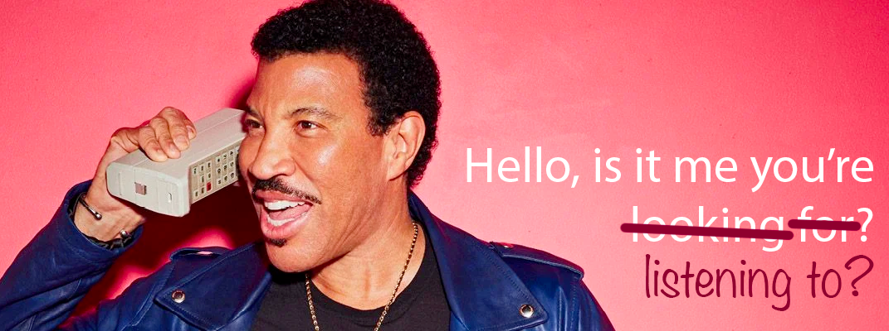

# Hello, is it me you're listening to?

## A guide to Laravel's event system.

Laravel has a powerful event system that allows listening to events and taking action when they occur.

I initially presented this talk at PHP Melbourne in November 2022.

This repository contains a simple Laravel application that demonstrates how to use the event system.

